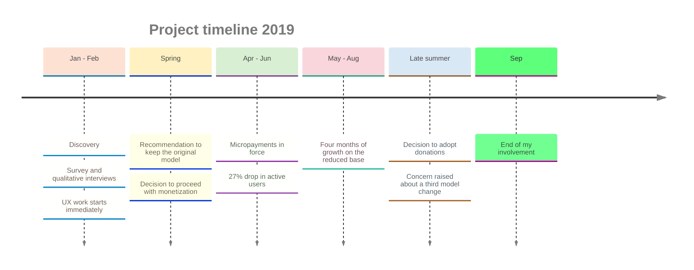
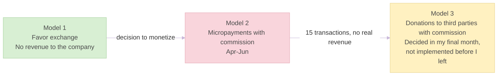
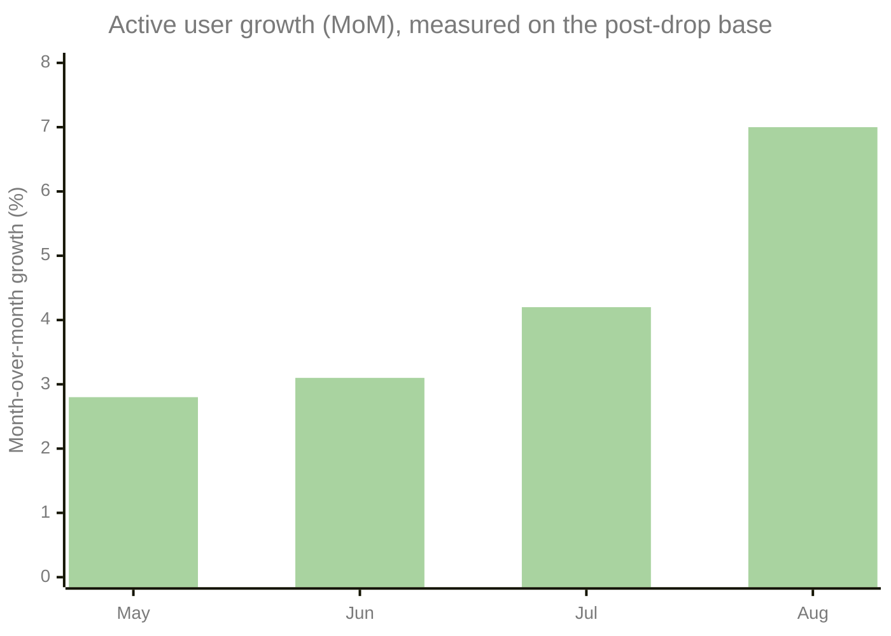

# Monetization Post-Mortem: Behavioral UX & Market Psychology

> **Descriptor:** *UK C2C Collaborative Economy & Peer-to-Peer Community Platform*  
> **Role:** *Senior Product Manager / UX Strategy Consultant (external consultant, embedded in the day-to-day team)*  
> **Timeline:** *January 2019 – September 2019*  
> **Status:** *Post-Mortem Analysis of the monetization experiment (scope ends at my departure)*

---

### Confidentiality Notice
> *Organization and project names have been anonymized for discretion and confidentiality. All quantitative metrics, survey response distributions, transaction counts, retention drops, and strategic product decisions presented strictly reflect actual professional experience.*

---

### 1. Executive Summary & Business Context
* **Context:** A UK C2C peer-to-peer collaborative app with **250,000 registered users**, centered on mutual aid, favor exchange and neighborly collaboration, with no monetization toward the company.
* **Business Challenge:** Find a sustainable revenue model for a zero-revenue social network under severe cash pressure (~8-month runway), without destroying user trust or engagement.
* **My Role:** Product and UX strategy lead for the monetization question and the user experience, working daily with the founders and the team. Hired as an external consultant.
* **Outcome:** The research pointed against changing the business model, although the evidence was not conclusive. The company went through **three models in six months**: favor exchange, micropayments with a commission, and donations to third parties with a commission. The micropayment model generated **only 15 transactions** in its final two months and a **27% relative drop in active users**. In parallel, the UX work started in the first two months coincided with **+13% in minutes of use per user in its first month** and **four consecutive months of user growth**.

---

### 2. Discovery & User Research (January – February 2019)
A dual-track research framework was run in the first two months:
* **Quantitative Survey (Email):** Surveyed the active registered base on payment gateways and fee models. **55% opposed vs. 45% in favor**: the change was rejected, but by a narrow margin.
* **External Qualitative Interviews:** Interviewed members of offline community volunteer groups who did not know the app, to avoid "Superfan / Complacency Bias". They rejected the change clearly.
* **Behavioral Finding (*Crowding-Out Effect*):** Direct financial exchange risks displacing social norms with market norms, destroying intrinsic altruistic motivation and social capital.
* **UX Findings:** The interviews exposed UX deficits, and a technical analysis identified numerous problems in **onboarding** (a lot of information requested up front, no scaffolding, no completion bar) and in the **core loop** (no defined user journey), plus an overly corporate brand tone for a peer-to-peer network.

**Reading the evidence:** user opposition was real but not definitive. The qualitative sample was small and concentrated in one very specific profile (socially aware people who did not know the app), and the most committed fans of the app supported the change.

| Source | Signal | Limitation |
|---|---|---|
| Email survey | Narrowly against (55% vs. 45%) | Small margin; not decisive |
| Qualitative interviews | Clearly against | Few interviews; one specific profile |
| Most committed fans | In favor | Superfan bias |

```mermaid
%%{init: {'theme':'base','themeVariables':{'lineColor':'#C9B8D9','edgeLabelBackground':'#FFFFFF','textColor':'#7A7A7A'}}}%%
flowchart LR
    M["Cash fee on a favor"] --> N["Market norms replace social norms"]
    N --> I["Intrinsic motivation drops"]
    I --> C["Fewer favors offered and accepted"]
    C --> D["Network effects weaken: active users fall"]
    classDef peach fill:#FDE2D4,stroke:#EBB9A3,color:#4A4A4A
    classDef butter fill:#FFF1C1,stroke:#E8D58F,color:#4A4A4A
    classDef mint fill:#D8EFD3,stroke:#A9D3A0,color:#4A4A4A
    classDef rose fill:#F9D5DC,stroke:#E5A9B5,color:#4A4A4A
    class M peach
    class N butter
    class I butter
    class C mint
    class D rose
```

---

### 3. Strategy & Solution Definition
* **Recommendation:** Keep the original model rather than proceed with the change, with three alternatives that preserve social capital: regional B2B sponsorships, managed impact campaigns, and a charity donation model.
* **Decision Taken:** The company decided to proceed with monetization. Sponsorships and impact campaigns were incorporated into the new model, at least in principle, and donations were kept as a fallback. Given the economic urgency, limited tests were ruled out before launch.
* **Crisis Communication, built around the founders:** The communication followed a three-step sequence: a written message to all users, a statement on all social networks and, one day later, the first of a series of videos in which a founder explained the decision.

### Key Decisions

1. **Recommending to keep the original model instead of optimizing the new one.** The evidence leaned against the change (a narrow survey margin and a clear qualitative rejection), and the crowding-out risk threatened the core loop of the product. The trade-off was that the evidence was not conclusive, which left the decision open.
2. **Working on UX in parallel, independent of the business model, instead of waiting for the monetization outcome.** The interviews exposed UX deficits right away, so work started at once. **Onboarding came first**, because if it fails the product puts barriers at its own front door, and **comprehension of how the app works came second**. Suggestions on the tone of communications were reviewed in parallel by the founders.
3. **Founder-led, multi-channel communication instead of a corporate announcement.** The app's early success was closely tied to the public presence of its two founders, young, frank communicators. A drastic change could feel like a betrayal of the personal trust users had placed in them, so the decision was for the founders to face it themselves, calmly, honestly and transparently, as an advance remedy against anger and disappointment.
4. **Model coherence instead of a third change.** Donations were among the alternatives considered. When the move to that model came up, the concern raised was that changing business model three times in six months confuses and demotivates the community and signals a lack of clear direction.

### Key Risks

| Risk | Early signal | What happened |
|---|---|---|
| **Crowding-out of altruistic motivation** | Qualitative interviews; narrow survey margin | Materialized: 15 transactions and a 27% relative drop in active users |
| **Thin evidence base leaves the decision open** | Small, specific interview sample; fan support | Materialized: the company proceeded with the change |
| **Trust tied personally to the founders** | App growth linked to their public persona | Mitigated: written, social and founder-video communication |
| **Cash urgency pushes decisions away from data** | No limited tests; model changes driven by revenue need | Materialized: three models in six months |
| **Slow sponsorship cycles** | Positive replies, but not a priority for the organizations | Pending during my tenure: local council, local charities and large tech companies responded well, but timelines were long |

---

### 4. Execution (Spring 2019)
* **Micropayments:** Introduced a micropayment system with a platform commission (3%–5% via Stripe), in force from April to June.
* **Communication:** The three-step sequence above contained the public reaction within owned channels.
* **Promotion:** Dedicated promotion of the new feature generated near-zero engagement.

---
### 5. Results of the Micropayment Model
* **Transactional Failure:** Only **15 completed transactions** in the model's final two months. Exposure data (how many users saw the payment option) was not available, so this figure cannot be expressed as a conversion rate; it should be read against a base of 250,000 registered users.
* **Active Users:** A **27% relative drop** in active users over a **7.5% baseline** (14-day window), taking it to roughly 5.5%.
* **Revenue:** Virtually none for two months, which led to the move to a new model.

---

### 6. UX Recovery & Retrospective
* **UX Work (started in months 1–2):** Onboarding first, then comprehension of the core loop, with suggestions on tone reviewed by the founders.

| Area | Problem found | Change implemented |
|---|---|---|
| **Onboarding** | A lot of information requested up front; no scaffolding; no completion bar | Initial data reduced to username and email only, with the remaining requests deferred until needed (for example, at payment); scaffolding system and completion bar added. Implemented with good results |
| **Core loop** | No defined user journey | User journey defined (fundamental steps and possible deviations) and a suggestion system created |

* **Impact:** **+13% in minutes of use per user in the first month**, growing afterwards, alongside four consecutive months of active user growth measured in May, June, July and August. Growth was calculated on the already reduced base left after the 27% drop.
* **Attribution:** Without a real-time measurement system, causality cannot be demonstrated. What can be said is that the gains coincided in time with the improvements and built up as they were applied.

* **Sponsorships and Impact Campaigns:** Contacts with the local council, local charities and large tech companies were broadly positive, but the processes were slow. They were not a priority activity for any of those organizations and clearly needed time, patience and consistency.
* **Donations:** The decision to adopt the donation system was taken in my final month, and I left in September before its implementation.
* **Scope:** This case covers my involvement until my departure in September 2019.

#### Key Learnings & Retrospective
1. **Incentive Compatibility (*Social vs. Market Norms*):** Monetizing peer-to-peer altruism through direct fees triggers a market mindset and puts trust and network effects at risk.
2. **UX Priority Over Monetization:** Usage and active users grew as the UX improvements were applied, while the monetization experiment produced no revenue. Causality cannot be demonstrated (see section 7), but the sequence points to UX as the priority.
3. **Mixed Evidence Leaves the Decision Open:** A narrow survey, a small and specific interview sample, and fan support do not settle a high-stakes decision. Evidence meant to guide it needs to be broader and more representative.
4. **Model Coherence:** Changing business model three times in six months confuses and demotivates the community and signals a lack of clear direction.
5. **Slow Revenue Paths Do Not Fit Urgent Cash Needs:** Sponsorships and impact campaigns require time, patience and consistency, so they have to be started and protected well before a cash crisis.

---

### 7. Mistakes & What I Would Do Differently
In a crisis, decisions are made across a minefield, half blind: a right call at the origin can trigger a chain of serious problems further down. For that reason these mistakes are listed without ranking. Viewed in hindsight, there are four.

| Mistake | What I would do differently |
|---|---|
| **Not being firmer in communication with the founders** about adopting a strictly data-driven decision system, while cash pressure pushed decisions toward intuition | Establish the decision framework (what evidence is required, and who decides on it) at the start and insist on it: crisis restructuring needs explicit evidence gates, not urgency alone |
| **Not continuing the qualitative and quantitative interviews**, which would have revealed more valuable information | Keep discovery running as a standing track alongside delivery, not as a one-off phase |
| **Not building a real-time statistics system** to measure the impact of micro-decisions as they happened | Instrument the product from the beginning so that every change can be measured in near real time |
| **Not refusing a third change of business model**, and not stepping away from the role once it was decided | Hold a clear red line on model changes, and treat leaving as a legitimate option when a direction cannot be influenced |

