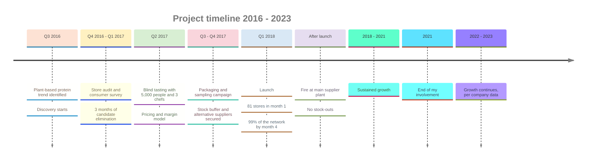
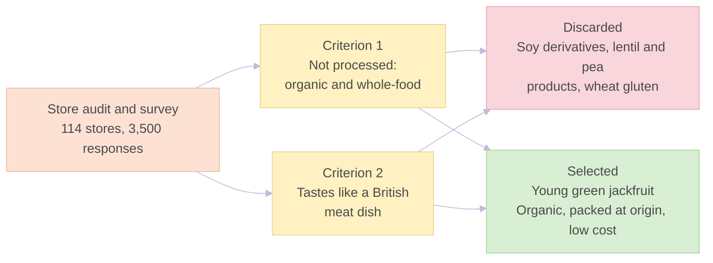
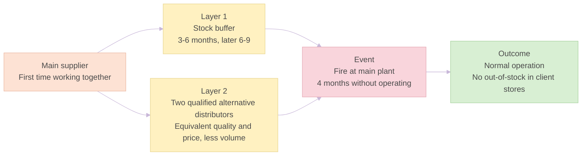
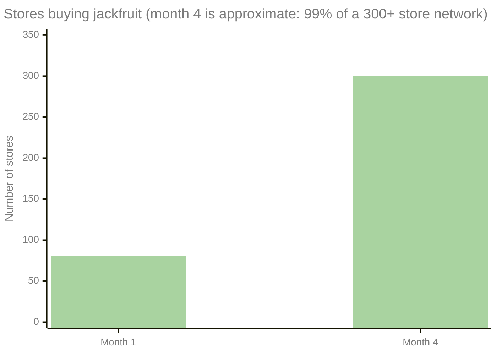
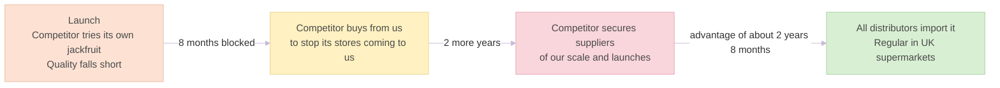
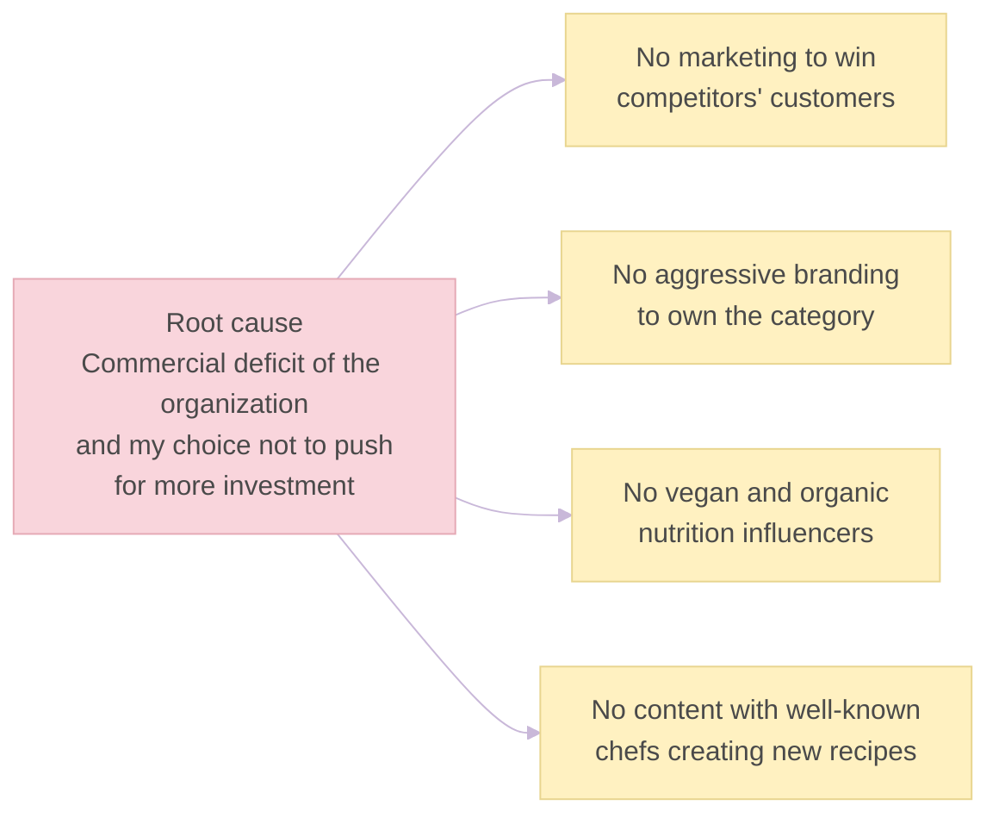

# Launch & B2B Scaling: Product-Market Fit in CPG Distribution

> **Descriptor:** *UK-based B2B Sustainable Food Import & Wholesale Cooperative*  
> **Role:** *E-commerce Product Manager & Data Analyst*  
> **Timeline:** *September 2016 – 2021 (growth data for the two years after my departure provided by the company)*  
> **Status:** *Fully executed & scaled*

---

### Confidentiality Notice
> *Organization and project names have been anonymized for discretion and confidentiality. All quantitative metrics, retailer adoption curves, supply chain data, margin structures, and strategic product decisions presented strictly reflect actual professional experience. Growth figures for the two years after my departure in 2021 were provided by the company.*

---

### 1. Executive Summary & Business Context
* **Context:** A UK B2B cooperative importer and wholesaler specializing in ethical, organic, and sustainable food products, supplying a network of **300+ independent retail stores** across the South West of the UK.
* **Business Challenge:** Company revenue had stagnated, with **growth below 1%** in the preceding period. The usual levers (pricing, range extension, acquiring new stores and entering other categories) had already been executed in previous years without breaking the stagnation. The company needed a genuinely new category that did not compromise its ethical and organic sourcing values.
* **My Role:** E-commerce Product Manager and Data Analyst. In a lean cooperative with no dedicated product function, I took ownership of the jackfruit initiative, from discovery to launch.
* **Outcome:** The company introduced **Young Organic Jackfruit to the UK market**. Total company revenue grew **+15% in the 12 months after launch** (against previous growth below 1%). Growth was sustained for **6 consecutive years**: throughout my time at the company until 2021 and for the two years after my departure, according to data provided by the company. In the following years every distributor, organic or not, began importing the product, and it is now a regular item in British supermarkets.

---

### 2. Discovery & User Research (Q3 2016 – Q1 2017)
* **Market Trend Identification (Q3 2016):** Mapped global plant-based protein innovations to address a clear market gap in unrefined, whole-ingredient meat alternatives.
* **Multi-Layered Field Research:**
  * **Retail Point-of-Sale Audit:** Partnered with the internal delivery fleet to run a 5-question covert survey across **114 retail client stores** during delivery drops (85% response rate).
  * **Mass Quantitative Survey:** Surveyed an end-user database of 30,000 contacts, securing **3,500 valid responses** (11.7% response rate).
* **Key Research Insights:**
  * **Rejection of Processed Substitutes:** Conscious consumers did not want processed products and preferred organic, whole-food ingredients.
  * **Demand for Gastronomic Familiarity:** Buyers lacked a versatile whole-food ingredient able to replicate the taste and pulled texture of a traditional British meat dish.
* **Candidate Elimination (3 months):** Soy derivatives, legumes (lentils and peas) and wheat gluten were tested and discarded for two consumer-driven reasons: they were processed products, and none of them tasted like a typical British meat dish. **Organic certification was a decisive criterion** in the selection. **Import cost was not**: the company was used to importing from South America, Southeast Asia, Africa and anywhere else in the world.
* **Why Jackfruit:** Green jackfruit in brine or water passed the filter on three counts: it **tasted like British pulled pork**, it was available **organic and properly packed at origin**, and it was **cheap, leaving very attractive margins**.

**Reading the evidence:** each source supports part of the decision, and each has limits worth stating.

| Source | Signal | Limitation |
|---|---|---|
| Store audit (114 stores) | Consumers want unprocessed, organic products | Covers roughly a third of a 300+ store network |
| End-user survey (3,500 responses) | Rejection of processed substitutes; need for a familiar meat-like dish | 11.7% response rate from the company's own database, so an already engaged audience |
| Blind tasting (5,000 responses) | 93% rated it "liked it a lot" | Participants were customers of network stores, an audience already inclined to organic food |
| Month-1 adoption (81 stores, 77.8%) | Strong initial pull | Measured on ~104 invited accounts, the strongest in the network, so not representative of all stores |

---

### 3. Strategy & Solution Definition (MVP & Unit Economics - Q2 2017)
* **Product Definition & Form Factor:** Sourced and branded young green jackfruit in brine and water as an unseasoned, shelf-stable culinary base for B2B food service and retail resale.
* **Blind Tasting & Chef Validation:** Blind tasting with about **5,000 people** (customers of the network's stores) and **3 professional chefs**. Only "liked it a lot" counted as positive ("not bad" did not), and **93%** of the 5,000 valid responses were positive. Results were segmented by age and sex with no substantive differences. The 3 chefs later developed the product's official recipes.
* **Financial Modeling & Margin Schemes:**
  * Priced slightly below the leading commercial seitan references to encourage fast adoption.
  * Structured B2B wholesale pricing tiers to guarantee healthy gross margins for both the cooperative and the independent retailers.

### Key Decisions

1. **A new category instead of repeating the usual levers.** Price changes, range extensions, new-store acquisition and other categories had already been tried in previous years, and growth stayed below 1%. The trade-off was launching a product with no track record in the UK market.
2. **Choosing the product by consumer criteria instead of import cost.** Surveys said consumers rejected processed products and wanted organic, and that the product had to taste like a British meat dish. This ruled out soy derivatives, lentil and pea products and wheat gluten. Import cost did not weigh in, because the company already imported from anywhere in the world.
3. **Jackfruit priced below seitan.** Low sourcing cost left room to undercut the market reference and still protect margin for the cooperative and its retailers, which favored fast adoption.
4. **Two-layer supply protection instead of relying on a single supplier.** It was the first time the company worked with that distributor, so it made a large initial purchase to keep stock through several months of production failure (3 to 6 months, later extended to **6–9 months** because of long maritime lead times), and it qualified **two other distributors** equivalent in quality and price, though unable to match the first one's volume. The trade-off was tied-up capital, which was accepted as a necessary risk.
5. **Validating with real consumers and chefs before scaling.** Blind tasting with 5,000 people and 3 chefs came before full-scale importation. The chefs then became the authors of the product's recipes, which fed the recipe guides in the packaging and point-of-sale material.

### Key Risks

| Risk | Preventive measure | What happened |
|---|---|---|
| **Failure of a new, unproven supplier** | Large initial stock purchase; two alternative distributors qualified | Materialized: a serious fire stopped the main supplier's plant for **4 months**, a few months after launch. Stock plus alternative distributors kept operations normal, with no stock-outs |
| **International maritime disruption** | Stock buffer extended from 3–6 to 6–9 months | Piracy off Somalia, conflicts in the Gulf region and other global disruptions occurred during my years at the company. None ever affected supply |
| **Consumer rejection of a new category** | Blind tasting with 5,000 people before importing at scale | Not materialized: 93% positive |
| **Tied-up capital in stock** | Accepted deliberately as the price of supply security | Accepted cost: it is what made continuous supply possible during the fire |
| **Competitor reaction** | Quality and price advantage; early supply dominance | Partly materialized: the main regional competitor tried its own jackfruit, but its quality fell short (see section 5) |
| **Erosion of the pioneer advantage** | None: no brand was built around the category | Materialized after launch: every distributor started importing it in following years |

---

### 4. Execution & Go-To-Market (GTM - Q3 2017 – Q4 2017)
* **Packaging & Positioning:** Designed eco-friendly B2B and retail-ready packaging with clear nutritional profiles, origin transparency and easy-to-cook recipe guides.
* **B2B Co-Creation & Sampling Campaign:**
  * Deployed a targeted sampling strategy across key organic retail accounts and regional vegan food service clients.
  * Distributed point-of-sale (POS) displays, recipe cards and tasting kits to support in-store customer activation.
* **Supply Chain Risk & Operations Management:**
  * **Layer 1, stock:** an initial buffer of 3 to 6 months, later extended to 6–9 months.
  * **Layer 2, suppliers:** two additional distributors equivalent in quality and price, ready to cover the main supplier.
  * **Result:** the plant fire and the maritime disruptions never produced an out-of-stock event in client stores.

---

### 5. Business Results & Impact (Q1 2018 Onward)
* **Rapid Channel Adoption Curve:**
  * **Month 1:** Adopted by **81 stores**, a **77.8% adoption rate** among the ~104 accounts invited first. Those were the stores with the highest purchase volumes, the most recurrent orders, the most strategic locations or the longest relationship with the company.
  * **Month 4:** **99% of the client network** (300+ stores) was buying the product.
* **Reorder Rate:** **97%** of stores that had bought jackfruit bought it again within the following 30 calendar days. Reorder was defined at store level.
* **Top-Line Financial Impact:**
  * **+15% total company revenue** in the 12 months after launch, against previous growth below 1%. The figure is not split between direct jackfruit sales and the pull-through effect on other categories.
  * **Basket Expansion (Cross-Selling Effect):** Purchases were compared week by week within the month (first week, second week, and so on) depending on whether they included jackfruit. Orders with jackfruit showed a **3% to 7% increase in total basket size**. This is not a formal control group: stores adding jackfruit may already have been those placing larger orders.
* **Competitive Impact:** The main regional competitor tried to develop its own jackfruit, but its product did not match ours in quality. It was blocked for **8 months** and then needed **two more years** to secure suppliers of our scale and launch its own product, so the advantage lasted about **2 years and 8 months**. In the meantime it bought product from us to prevent its store network from coming to us directly.
* **After the Advantage:** In the following years every distributor, organic and non-organic, began importing it, and it is now a regular product in British supermarkets. The category we opened turned out to be real, and so did the end of the pioneer advantage.
* **Data Availability:** I left the company in 2021 and no longer have access to detailed figures such as margins, prices or the capital tied up in stock. They are not reported here rather than estimated.

---

### 6. Retrospective & Key Learnings
1. **Validation Before Scaling:** Blind tasting with 5,000 people and 3 chefs before full-scale importation, with a strict criterion ("liked it a lot" only), underpinned the 97% reorder rate.
2. **Consumer Criteria Over Cost Criteria:** The product was chosen for what consumers said they wanted (unprocessed, organic, familiar taste), not for import cost, which was not a constraint for this company.
3. **Layered Supply Security:** Stock and alternative suppliers together turned a serious supplier fire into a non-event for client stores. Tied-up capital was a necessary risk, not a waste.
4. **A First-Mover Advantage Is Real but Temporary:** It lasted about 2 years and 8 months against the main competitor, and then the whole market imported the product. Without a brand built around it, the advantage does not become a lasting position.
5. **Commercial Strength Must Match Product Strength:** A great product was launched by an organization without the commercial muscle to own the category it had created (see section 7).

---

### 7. Mistakes & What I Would Do Differently
The launch was an unprecedented success: we introduced Young Organic Jackfruit to the UK and the company flourished for several years. What we did not do was take over the category, tie it to our own brand and become its evangelists. The four mistakes below are listed without ranking, and they share a single root cause: **the commercial deficit of the organization, and my own part in it**. As the only person leading a very small marketing department, I chose not to push for the larger commercial and marketing investment that the launch deserved once it had proved itself.

| Mistake | What I would do differently |
|---|---|
| **Not investing in marketing to grow our own market and win customers from competitors** | Set an explicit acquisition budget and targets for stores outside the network from the launch |
| **Not betting on aggressive branding to own the product category** | Build a brand identified with Young Organic Jackfruit from day one, so the category and our name are the same thing |
| **Not investing in vegan and organic-nutrition influencers** | Include an influencer program at launch to generate consumer pull-through, not only retailer push |
| **Not creating content with well-known chefs "creating" new jackfruit recipes** | Go beyond the 3 chefs who developed our recipes and build chef-led content that positions jackfruit as a gastronomic ingredient |

Not on this list, deliberately: depending on a single supplier (we had two other distributors qualified) and the capital tied up in stock (a necessary risk that made supply continuity possible).

