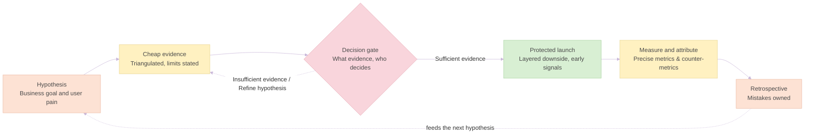

# My Product Management Playbook: Deciding with Partial Evidence

> **Purpose:** How I decide when evidence is partial, budget is minimal and formal authority is limited. Each principle is tied to the case study where I applied it, and the guardrails come from the mistakes I made along the way.

> **Cases referenced:** *CPG launch* (B2B jackfruit launch), *C2C post-mortem* (monetization of a peer-to-peer platform), *B2B2C pivot* (adult vertical for a gamified tourism platform).

---

### 1. The Decision Loop

---

### 2. Principles

**1. Triangulate, and state the limits of every source.**
I combine internal and external sources and write down what each one cannot tell me. I deliberately include people who do not know the product, to filter out *Superfan / Complacency Bias*.
* *Seen in:* C2C post-mortem (email survey plus external interviews, with a source / signal / limitation table), CPG launch (store audit plus consumer survey), B2B2C pivot (150 municipal interviews, a user survey and field audits).
* *Watch for:* mixed evidence is not conclusive evidence. A narrow survey margin and a small interview sample left a high-stakes decision open in C2C.

**2. Buy evidence cheaply before committing capital.**
Whenever the next step is expensive or hard to reverse, I look for a cheaper way to test it first.
* *Seen in:* CPG launch (blind tasting with 5,000 people and 3 chefs before importing at scale), B2B2C pivot (pilot contracts pre-sold and prototypes shown to municipalities before code freeze).
* *Watch for:* cash pressure that pushes decisions away from limited tests. In C2C the company went through three models in six months.

**3. Create the opportunity from existing resources.**
With no extra budget, I look first at what the company already owns: infrastructure, relationships, supply chains.
* *Seen in:* B2B2C pivot (re-architecting the existing engine for an adult audience at zero new core development CapEx, with instant QR/web access and no mandatory sign-up).

**4. Open new space instead of pushing exhausted levers.**
If the usual levers have already been tried, repeating them is not a strategy. In saturated markets I prefer a complementary entry to a head-on one.
* *Seen in:* CPG launch (pricing, range extension, store acquisition and other categories had already been tried, so the answer was a new category), B2B2C pivot (an adult product as a "Trojan Horse" that is additive and does not require displacing the incumbent).

**5. Protect the downside in layers and name the early signals.**
For each risk I record the early signal, the preventive measure and what actually happened.
* *Seen in:* CPG launch (stock buffer plus two qualified alternative suppliers, which absorbed a four-month supplier plant shutdown with no stock-outs), B2B2C pivot (downside contained by minimal investment, with early-warning indicators agreed with pilot municipalities once real usage data exists).

**6. Define every metric precisely and declare what it does not prove.**
A number without its definition and its limits invites doubt about all the others. When data is missing, I say so instead of estimating.
* *Seen in:* CPG launch (reorder defined at store level within 30 calendar days; basket size compared week by week, with the lack of a formal control group stated), C2C post-mortem (no exposure data, so no conversion rate; no real-time measurement, so causality is not claimed).
* *Watch for:* without real-time measurement, improvements can only be said to coincide with a result, not to cause it.

**7. Set evidence gates, agree who decides, and build alliances.**
I agree up front what evidence is required for a decision and who takes it. In organizations where decisions are ratified collectively, I produce the evidence and build support across functions: the promoter proposes, the decision body decides.
* *Seen in:* CPG launch (a cooperative where decisions go through committees and assemblies), B2B2C pivot (coordination with the founders where relevant), C2C post-mortem (where the missing gate became a mistake).
* *Watch for:* urgency alone pushing decisions toward intuition.

**8. A launch is not finished until the commercial side is.**
A good product needs the commercial push, the brand and the instrumentation to keep its position.
* *Seen in:* CPG launch (the pioneer advantage lasted about 2 years and 8 months against the main competitor, and then every distributor was importing the product), C2C post-mortem (a product that could not measure the impact of its own decisions as they happened).

---

### 3. Mistakes That Shaped This Method

| Mistake | Guardrail it created |
|---|---|
| **Not insisting on a data-driven decision system** while cash pressure pushed toward intuition (C2C) | Evidence gates agreed at the start: what evidence is required and who decides (principle 7) |
| **Not continuing interviews** once the first discovery phase ended (C2C) | Discovery as a standing track alongside delivery, not a one-off phase |
| **Not building real-time statistics** to measure micro-decisions (C2C) | Instrument the product from day one so every change can be measured (principle 6) |
| **Not holding a red line** on a third business model change (C2C) | Clear red lines on direction changes, and leaving as a legitimate option when a direction cannot be influenced |
| **Not investing in the commercial side after a successful launch**: no customer acquisition from competitors, no aggressive branding, no influencers, no chef-led content (CPG) | A commercial budget and a brand plan decided at launch, not afterwards (principle 8) |

---

### 4. Tools: A Pragmatic Policy

I use every conceptual or software tool when it is possible and pertinent, not by default. The tool serves the problem, not the other way round.

* **Prioritization:** RICE (Reach, Impact, Confidence, Effort) or Value vs. Effort matrices when there is a backlog to rank and enough information to estimate each factor.
* **Data analysis:** AI-assisted analysis when data governance allows sharing the dataset directly. SQL when privacy requirements or management policy rule that out. In both cases the question comes first and the method second.
* **Telemetry:** Metric trees for acquisition, activation, completion and cohort retention. In the B2B2C pivot, a custom analytics portal (+100 metric combinations) tracking 15-day, 1-month, 3-month, 6-month and 1-year intervals across 150 deployments.
* **Qualitative research:** User interviews, field usability testing and session replay audits, as the product and context allow.
* **Delivery:** Product specs, user stories and acceptance criteria written with UX and engineering when a dedicated team exists.
* **Roadmapping:** Short-term (12-month) operational targets alongside long-term (2–3 year) expansion objectives, as in the B2B2C pivot.

